<h1 align="center">Dmitriy — Backend Developer</h1>
<h3 align="center">Python · FastAPI · Telegram Bots & Automation</h3>

  

  

---

### 🧑‍💻 Обо мне

- 🎓 Прошёл годовые курсы по **Python** и **C#**
- 🏆 Победитель городского хакатона по backend-разработке на Python
- 🧠 Сейчас изучаю **FastAPI** и погружаюсь в **нейронные сети**
- 🚀 Разрабатываю собственный **SaaS Telegram-бот-менеджер**
- 🌍 Живу в Коврове
- ✉️ Написать мне: [dimsmir10@gmail.com](mailto:dimsmir10@gmail.com)

---

### 🛠 Технологии

---

### 📊 GitHub-статистика

  
  

  

---

### 🌐 Соцсети

